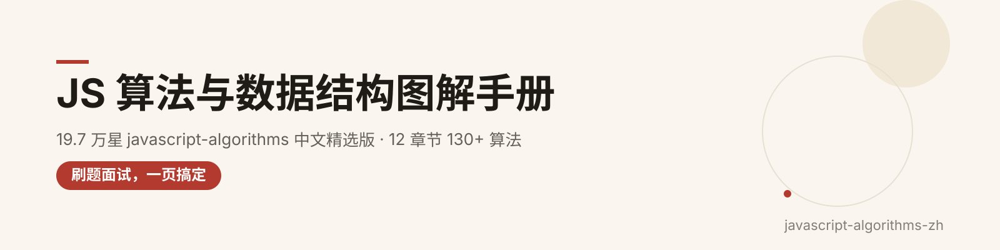
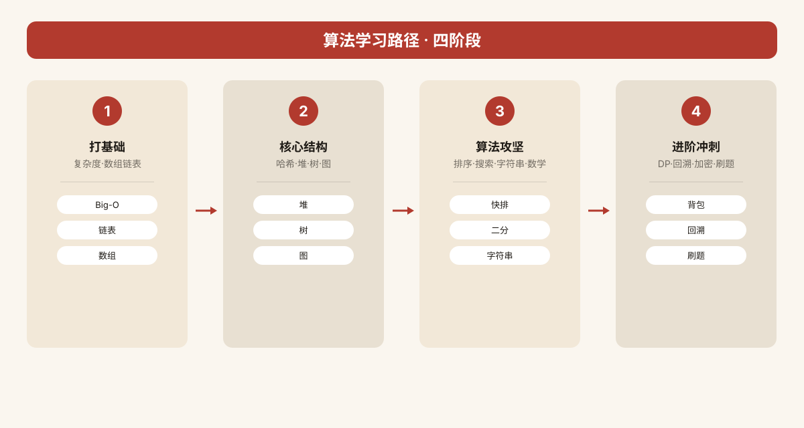

  

<h1 align="center">javascript-algorithms-zh</h1>

> **19.7 万 star 的「JS 算法图解库」，终于有中文版了。**
>
> 从 GitHub 顶流仓库 [trekhleb/javascript-algorithms](https://github.com/trekhleb/javascript-algorithms)（MIT © Oleksii Trekhleb，19.7 万 star）的 120+ 算法与数据结构里，精选整理成 **12 个章节**：每个算法都配**中文算法思想讲解 + 复杂度分析 + 原项目真实代码链接**，中文开发者刷题、面试、做方案时的 JS 实现手册。

---

⭐ 如果对你有帮助，点个 Star 支持中文开源

## ✨ 为什么值得收藏

- **覆盖 120+ 算法/结构**：链表/栈/队列/哈希/堆/树/图/排序/搜索/字符串/数学/DP/回溯/加密……一网打尽；
- **中文讲解**：每个条目 2-4 句讲清「是什么、怎么实现、关键点」，不再对英文 README 犯怵；
- **复杂度一目了然**：时间/空间复杂度按标准值标注，面试答复杂度张口就来；
- **链接真实可核验**：全部指向原项目 `src/` 下对应实现，零占位符、零编造；
- **刷题伴侣**：章末学习提示教你配什么题练手。

---

## 🗂 章节总览

| # | 章节 | 条目 | # | 章节 | 条目 |
| --- | --- | --- | --- | --- | --- |
| 1. 复杂度与仓库导读 | 6 | 7. 算法：图算法与搜索 | 19 |
| 2. 数据结构：链表·栈·队列 | 8 | 8. 算法：字符串 | 12 |
| 3. 数据结构：哈希·堆·优先队列 | 7 | 9. 算法：数学 | 15 |
| 4. 数据结构：树 | 12 | 10. 算法：动态规划与回溯 | 14 |
| 5. 数据结构：图与杂项 | 8 | 11. 算法：集合·加密·杂项 | 12 |
| 6. 算法：排序 | 10 | 12. 刷题实战与使用指南 | 6 |

| **合计** | **12 个章节** | **129 个条目** |  |  |  |

  

---

## 🚀 怎么用这份手册

1. **新手入门**：先读 01 复杂度与仓库导读（大 O 是面试第一道门槛），再按 02 → 05 的顺序把数据结构过一遍；
2. **面试冲刺**：重点啃 06 排序、07 图算法、10 动态规划（大厂算法面高频区）；
3. **刷题对照**：遇到不会的题，按主题找到对应算法，看中文思想讲解 → 点原项目实现看代码 → 回 LeetCode 练同类题；
4. **日常查表**：当速查手册用，随手翻。

> 原仓库每个算法都带 gif 动图演示与测试用例，链接进去直接看。

  

---

## 📖 字段说明

- **条目名**：中文名 + 英文原名（便于搜原仓库）；
- **中文讲解**：原创重述的算法思想/实现要点；
- **复杂度**：时间/空间复杂度，按该算法标准值标注；
- **🔗 原项目实现**：指向原仓库 `src/` 对应目录的 GitHub 链接。

---

# 章节正文

## 1. 复杂度与仓库导读（6 个条目）

> 本章是整本速查手册的地基：先建立大 O 复杂度的直觉与量级排序，再速查各类数据结构的操作代价，最后给出如何高效使用本仓库的学习路径。无论面试还是刷题，判断"该用什么结构、写出来跑多快"都从这里开始。

## 大 O 表示法与复杂度直觉

大 O 用来刻画算法的运行时间或空间随输入规模 n 增长的趋势，忽略常数项与低阶项，只保留增长最快的那一项。它回答的不是"跑几秒"，而是"n 翻十倍时，耗时大致翻多少倍"。

- **大 O 表示法（Big O Notation）**：一种渐近上界记号，把算法按"增长阶"分类，让我们能脱离具体硬件比较算法的相对优劣。面试中几乎所有时间/空间复杂度的追问都建立在它之上。｜复杂度：量级排序 O(1) < O(log n) < O(n) < O(n log n) < O(n²) < O(2^n) < O(n!)｜[🔗 原项目实现](http://bigocheatsheet.com/)
> 💡 学习提示：先把这张排序表背到条件反射，再去看每个算法为什么落到某一阶；bigocheatsheet.com 适合当长期对照表收藏。

- **复杂度增长曲线图（Big O Graph）**：把常见阶画在同一张坐标图上，直观展示当 n 增大时 O(n²)、O(2^n) 如何迅速甩开 O(n log n)，而 O(log n) 几乎是一条平线。看懂曲线的相对高度，比死记数字更能建立"n 很大时谁快"的直觉。｜复杂度：时间随阶数差异极大，从近乎 O(1) 到指数爆炸不等｜[🔗 原项目实现](https://github.com/trekhleb/javascript-algorithms/tree/master/./assets/big-o-graph.png)
> 💡 学习提示：在草稿纸上自己手画一遍 n=10/100/1000 时各阶的相对高度，印象会深很多。

## 数据结构与复杂度速查

选数据结构的本质是在"读、写、查、删"四种操作的代价之间做权衡，没有万能结构。

- **数据结构操作复杂度速查（Data Structure Operations Complexity）**：汇总数组、链表、哈希表、二叉搜索树、堆等结构在索引、查找、插入、删除上的平均与最坏代价。例如数组随机访问 O(1) 但中间插入 O(n)，哈希表平均 O(1) 但最坏冲突退化到 O(n)，BST 平均 O(log n) 最坏 O(n)。记牢这张表，选型时就能秒级判断。｜复杂度：随机访问 O(1)（数组）／查找平均 O(1)（哈希表）至 O(log n)（平衡树）｜
> 💡 学习提示：刷题遇到"为什么超时"时，先对着这张表反推当前结构的操作代价，往往能立刻定位到该换哈希表还是该堆化。

- **数据结构概念与手绘草图（Data Structure Sketches）**：数据结构是"组织、存储数据的方式 + 数据间关系 + 可施加的操作"的集合；学习时配合手绘节点与指针关系，比纯读代码更容易理解插入删除时指针怎么断、怎么接。原仓库也强调：先想清为什么选某种结构，再去关心它怎么实现。｜复杂度：—（概念性资源）｜[🔗 原项目实现](https://okso.app/showcase/data-structures)
> 💡 学习提示：每学一个新结构，都在纸上画一遍它的内存布局和一次插入/删除的指针变化。

## 仓库使用与学习资源

- **可视化算法视频合集（YouTube Playlist）**：本仓库配套的 YouTube 播放列表，逐结构、逐算法配有可视化动画讲解，适合在读完代码前先建立动态画面。｜复杂度：—（学习资源）｜[🔗 原项目实现](https://www.youtube.com/playlist?list=PLLXdhg_r2hKA7DPDsunoDZ-Z769jWn4R8)
> 💡 学习提示：建议"先看动画 → 再读 README → 最后跑测试"三步走，比直接啃源码效率高。

- **本仓库中文文档（README.zh-CN.md）**：trekhleb/javascript-algorithms 的官方简体中文版首页，是你在仓库里跳转各条目、对照中英术语的总入口。｜复杂度：—（文档入口）｜[🔗 原项目实现](https://github.com/trekhleb/javascript-algorithms/tree/master/README.zh-CN.md)
> 💡 学习提示：用中文版建立术语表，再切到英文源码目录核对实现细节，避免中英术语混淆。

## 2. 数据结构-链表栈队列（8 个条目）

> 本章覆盖最基础、面试出现频率最高的四类线性结构：链表（含双向）、栈、队列与双端队列，以及配套的遍历与括号校验小题。它们是理解 LRU、单调栈、BFS 队列等高级套路的前置，必须能手写、能说清指针操作。

## 链表

链表用节点 + 指针串联数据，内存不必连续，擅长已知位置的动态插入删除。

- **单链表（Linked List）**：每个节点只持有数据与指向下一节点的指针，首尾相接成一条链。随机访问需从头遍历，但在已知位置处插入/删除只需改指针、无需搬移后续元素，是动态集合的基础结构。｜复杂度：访问/查找 O(n)，头部插入 O(1)，任意位置插入删除 O(n)（定位）｜[🔗 原项目实现](https://github.com/trekhleb/javascript-algorithms/tree/master/src/data-structures/linked-list)
> 💡 学习提示：配合 LeetCode 第 206、141、19 题练手，重点画清 prev/current 两个指针在交换时的指向。

- **双向链表（Doubly Linked List）**：在单链表基础上每个节点再加一个指向前驱的指针，因此可以正向也可以反向遍历，头尾两端都能高效操作。代价是每个节点多占一个指针空间。｜复杂度：头尾插入删除 O(1)，按值查找仍 O(n)，空间比单链多一倍指针｜[🔗 原项目实现](https://github.com/trekhleb/javascript-algorithms/tree/master/src/data-structures/doubly-linked-list)
> 💡 学习提示：LRU 缓存正是"哈希表 + 双向链表"的组合，学完直接去刷 LRU 那题。

- **正向遍历链表（Straight Traversal）**：从表头出发，沿 next 指针依次访问每个节点直到末尾，是链表最基本的访问范式。理解它是做反转、归并、求倒数第 k 个节点等题的前提。｜复杂度：时间 O(n)，空间 O(1)｜[🔗 原项目实现](https://github.com/trekhleb/javascript-algorithms/tree/master/src/algorithms/linked-list/traversal)
> 💡 学习提示：写一遍 while (current) { 访问; current = current.next; } 模板，后续题目基本都是在此基础上加工。

- **反向遍历链表（Reverse Traversal）**：单链表没有前驱指针，反向遍历通常靠递归（先递归到底再回溯访问）或先反转链表再正向走。它直观展示了递归调用栈如何天然充当"逆向"容器。｜复杂度：时间 O(n)，递归空间 O(n)／反转后空间 O(1)｜[🔗 原项目实现](https://github.com/trekhleb/javascript-algorithms/tree/master/src/algorithms/linked-list/reverse-traversal)
> 💡 学习提示：把递归版和反转链表版都写一遍，体会两种"反向"思路的时空取舍。

## 栈、队列与双端队列

这三者都是受限制的线性表：按固定进出顺序操作，是函数调用、BFS、括号匹配等模型的物理载体。

- **栈（Stack）**：后进先出（LIFO）的线性表，只在同一端压入(push)与弹出(pop)。函数调用栈、表达式求值、括号匹配、DFS 递归本质上都用栈。｜复杂度：push/pop/top 均 O(1)，查找需 O(n)｜[🔗 原项目实现](https://github.com/trekhleb/javascript-algorithms/tree/master/src/data-structures/stack)
> 💡 学习提示：用数组或链表手写一个栈，再去刷"单调栈"系列（每日温度、柱状图最大矩形）。

- **队列（Queue）**：先进先出（FIFO）的线性表，队尾入、队头出。是 BFS、消息队列、任务调度的核心结构，用循环数组实现可避免搬移已出队元素。｜复杂度：enqueue/dequeue/front 均 O(1)，查找 O(n)｜[🔗 原项目实现](https://github.com/trekhleb/javascript-algorithms/tree/master/src/data-structures/queue)
> 💡 学习提示：BFS 的模板就是"起点入队 → 出队并扩展邻居入队"，先刷二叉树层序遍历建立手感。

- **双端队列（Deque）**：两端都可进出的队列，融合了栈与队列的能力，既能当栈用也能当队列用。滑动窗口最大值等单调双端队列题依赖它。｜复杂度：两端插入/删除/查看均 O(1)，查找 O(n)｜[🔗 原项目实现](https://github.com/trekhleb/javascript-algorithms/tree/master/src/data-structures/deque)
> 💡 学习提示：刷 LeetCode 第 239 题（滑动窗口最大值）前，先搞清楚 deque 里为什么只存下标而不存值。

- **有效括号（Valid Parentheses）**：用栈判断字符串中的括号是否正确配对——遇左括号入栈，遇右括号则弹出栈顶匹配，最后栈空即合法。是栈思想最经典的入门应用。｜复杂度：时间 O(n)，空间 O(n)（最坏全是左括号）｜[🔗 原项目实现](https://github.com/trekhleb/javascript-algorithms/tree/master/src/algorithms/stack/valid-parentheses)
> 💡 学习提示：LeetCode 第 20 题；做完再挑战第 32 题（最长有效括号）体会栈的进阶用法。

## 3. 数据结构-哈希堆与优先队列（7 个条目）

> 本章围绕"以 O(1) 或 O(log n) 快速定位/取出最值"展开：哈希表提供近常数级的键值查找，堆与优先队列提供动态取最值能力，再延伸到滚动哈希、堆排序、布隆过滤器与 LRU 缓存。这些是中高级面试与工程系统的高频结构。

## 哈希与键值查找

哈希表把键通过散列函数映射到数组下标，实现近常数级的存取；碰撞处理与扩容是它的工程关键。

- **哈希表（Hash Table）**：由数组 + 散列函数 + 冲突解决（链地址法/开放寻址）组成，按键存取平均接近 O(1)。是字典、缓存、去重、计数的首选结构，负载因子过高时需要扩容再散列(rehash)。｜复杂度：查找/插入/删除平均 O(1)，最坏冲突退化 O(n)，空间 O(n)｜[🔗 原项目实现](https://github.com/trekhleb/javascript-algorithms/tree/master/src/data-structures/hash-table)
> 💡 学习提示：手写链地址版哈希表，并理解负载因子与 rehash 的触发时机；刷题时能脱口而出"该用 map 还是数组"。

- **多项式滚动哈希（Polynomial Hash）**：把字符串按多项式系数展开成一个整数哈希值，支持在 O(1) 时间内滚动更新（滑过一个字符即可重算）。是 Rabin-Karp 等字符串快速匹配的核心。｜复杂度：预处理 O(n)，单次滚动重算 O(1)，空间 O(n)｜[🔗 原项目实现](https://github.com/trekhleb/javascript-algorithms/tree/master/src/algorithms/cryptography/polynomial-hash)
> 💡 学习提示：配合 Rabin-Karp 模板题理解"为什么滑动窗口能 O(1) 更新哈希"，别只背公式。

- **布隆过滤器（Bloom Filter）**：用多个哈希函数 + 一个位数组做概率性集合判定——"判存在"可能误判，但"判不存在"一定准确。空间极省，常用于缓存前的快速拦截，避免请求穿透到后端。｜复杂度：插入/查询 O(k)（k 为哈希函数个数），空间远小于真实集合｜[🔗 原项目实现](https://github.com/trekhleb/javascript-algorithms/tree/master/src/data-structures/bloom-filter)
> 💡 学习提示：重点想清"为什么会假阳性、为什么不会假阴性"，这是面试追问的高频点。

- **LRU 缓存（LRU Cache）**：最近最少使用淘汰策略，用"哈希表 + 双向链表"组合实现：哈希表定位节点 O(1)，双向链表维护使用顺序并把最新访问的节点移到队首、淘汰队尾。要求 get/put 都在 O(1) 完成。｜复杂度：get/put 均 O(1)，空间 O(capacity)｜[🔗 原项目实现](https://github.com/trekhleb/javascript-algorithms/tree/master/src/data-structures/lru-cache/)
> 💡 学习提示：LeetCode 第 146 题，务必自己用 JS 手写一遍双向链表 + map 的组合。

## 堆与优先队列

堆是一棵满足"父节点优先于子节点"的完全二叉树，通常用数组实现，支持动态取最值。

- **堆（Heap）**：分为大顶堆（父≥子）与小顶堆（父≤子），用数组表示完全二叉树，节点 i 的左右孩子位于 2i+1、2i+2。上浮(shiftUp)与下沉(shiftDown)是建堆与维护的核心操作。｜复杂度：建堆 O(n)，插入/删除最值 O(log n)，取最值 O(1)｜[🔗 原项目实现](https://github.com/trekhleb/javascript-algorithms/tree/master/src/data-structures/heap)
> 💡 学习提示：手推一次上浮和下沉的交换过程，堆排序与 Top-K 都建立在这两个操作上。

- **优先队列（Priority Queue）**：按元素优先级而非入队顺序出队的队列，底层通常用堆实现。每次取出当前优先级最高（或最低）的元素，是 Dijkstra、任务调度、Top-K 的关键工具。｜复杂度：取最值 O(1)，入队/出队 O(log n)｜[🔗 原项目实现](https://github.com/trekhleb/javascript-algorithms/tree/master/src/data-structures/priority-queue)
> 💡 学习提示：刷"合并 K 个有序链表"（LeetCode 23）与"数据流中位数"（295）体会优先队列的威力。

- **堆排序（Heap Sort）**：先把数组建成大顶堆，然后反复把堆顶（最大值）与末尾交换、堆大小减一、下沉修复，原地完成排序。不需要额外数组，但常数比快排大，实际工程中较少直接使用。｜复杂度：时间最好/平均/最坏均 O(n log n)，空间 O(1) 原地｜[🔗 原项目实现](https://github.com/trekhleb/javascript-algorithms/tree/master/src/algorithms/sorting/heap-sort)
> 💡 学习提示：重点对比"整体建堆 O(n)"与"逐个插入建堆 O(n log n)"的差异，这是常考辨析点。

## 4. 数据结构：树（12 个条目）

> 树是一种分层的非线性结构，由根节点延伸出若干互不相交的子树。本章从抽象树与二叉树讲起，覆盖 AVL、红黑树等自平衡二叉搜索树，再到线段树、树状数组这类区间查询利器，以及字典树与两种经典遍历方式。

## 一、二叉搜索树与自平衡树

这是树结构面试的核心：先理解二叉搜索的有序性，再看各路平衡方案如何用旋转把最坏情况拉回 O(log n)。

- **树（Tree）**：树是 n 个节点组成的有限层次集合，有且仅有一个根节点，其余节点被划分成若干互不相交的子树；它是所有具体树结构的抽象基类，定义了遍历、搜索、插入、删除等通用接口。实现上通常用带 left / right / parent 指针的节点表示，配合 DFS 或 BFS 完成遍历。面试常考树与图的本质区别：树连通、无环、恰有 n-1 条边。｜复杂度：树高 h，操作平均 O(h)｜[🔗 原项目实现](https://github.com/trekhleb/javascript-algorithms/tree/master/src/data-structures/tree)
> 💡 学习提示：先吃透这棵"抽象树"，再去看 BST、AVL 都是它的特化，理解会顺很多。

- **二叉树（Binary Tree）**：每个节点最多含两个子节点（左子、右子）的树，是 BST、堆、表达式树等的通用骨架；满二叉树、完全二叉树、平衡二叉树都是它的特例。实现上以左右孩子指针为核心，配合前中后序与层序遍历即可覆盖绝大多数考题。面试高频问"给定两种遍历序列能否唯一还原二叉树"。｜复杂度：遍历 O(n)，平衡时高 O(log n)
> 💡 学习提示：把"前中后序 + 递归/迭代"四种写法默写熟，二叉树题就拿下了一半。

- **二叉搜索树（Binary Search Tree）**：左子树所有节点值小于根、右子树所有节点值大于根的二叉树，其中序遍历即得有序序列。插入与查找沿一条根到叶的路径下降，平均 O(log n)；但若按有序序列依次插入，树会退化成链表，最坏 O(n)。面试必考"验证 BST""第 K 大节点""两节点最近公共祖先"。｜复杂度：平均 O(log n)，最坏 O(n)；空间 O(n)｜[🔗 原项目实现](https://github.com/trekhleb/javascript-algorithms/tree/master/src/data-structures/tree/binary-search-tree)
> 💡 学习提示：亲手画一棵退化成链表的 BST，你就明白为什么还需要 AVL 和红黑树。

- **AVL 树（AVL Tree）**：以发明者 Adelson-Velsky 与 Landis 命名的严格平衡 BST，要求任一节点左右子树高度差（平衡因子）的绝对值不超过 1。插入或删除后若失衡，通过右旋、左旋、左右双旋、右左双旋四种旋转恢复平衡，从而把任何操作都锁死在 O(log n)。面试常考四种旋转的触发条件与平衡因子的更新。｜复杂度：查找/插入/删除 O(log n)；空间 O(n)｜[🔗 原项目实现](https://github.com/trekhleb/javascript-algorithms/tree/master/src/data-structures/tree/avl-tree)
> 💡 学习提示：拿一个有序序列手动插入 8 个节点，把每次旋转画出来，比背结论管用得多。

- **红黑树（Red-Black Tree）**：一种弱平衡 BST，通过给节点染红/黑并约束"根黑、叶子哨兵黑、红节点的孩子必黑、任一节点到其后代叶子的黑节点数相同"，保证最长路径不超过最短路径的两倍。它不像 AVL 那样严格平衡，插入/删除最多做三次旋转即可修复，因此工程上（Linux 调度、Java TreeMap、C++ map）首选。面试常与 AVL 对比：AVL 查得多、红黑树改得多。｜复杂度：查找/插入/删除 O(log n)；空间 O(n)｜[🔗 原项目实现](https://github.com/trekhleb/javascript-algorithms/tree/master/src/data-structures/tree/red-black-tree)
> 💡 学习提示：不必死记变色加旋转的全部 case，先理解"黑高一致"这条核心不变量。

## 二、区间查询与索引树

这类树不是为了存键值对，而是为了在数组上做高效的区间统计。

- **线段树（Segment Tree）**：把区间 [l, r] 不断二分存成一棵完全二叉树，每个节点记录该区间的 min / max / sum 等聚合值。单点修改与任意区间查询都沿 O(log n) 层下降，通常用数组做堆式存储。区间求和、区间最值是它的主场，竞赛与面试区间题常考。｜复杂度：建树 O(n)，查询/更新 O(log n)；空间 O(n)｜[🔗 原项目实现](https://github.com/trekhleb/javascript-algorithms/tree/master/src/data-structures/tree/segment-tree)
> 💡 学习提示：先会写"区间求和"线段树，再推广到 min / max，套路完全一致。

- **树状数组（Fenwick Tree / Binary Indexed Tree）**：利用下标二进制的最低位 1（lowbit）把前缀区间切成若干段存储，从而在 O(log n) 内完成单点更新与前缀和查询。相比线段树它代码极短、常数极小，但只能处理可加、可逆的前缀类问题。面试常考"用 lowbit 推导 update 与 query 的下标跳跃规律"。｜复杂度：更新/查询 O(log n)；空间 O(n)｜[🔗 原项目实现](https://github.com/trekhleb/javascript-algorithms/tree/master/src/data-structures/tree/fenwick-tree)
> 💡 学习提示：手画一棵长度 8 的 Fenwick 树，标好每个下标管哪一段区间，立刻通透。

- **B 树（B-tree）**：多路平衡查找树，每个节点可存放多个关键字并分叉出多个孩子，整棵树矮胖，专为磁盘/数据库这种"读一块拿一批"的存储设计。B+ 树是其最常用变体：卫星数据全部落在叶子层、内部节点只存索引用链表把叶子串起来，正是 MySQL 索引的底层结构。面试常问"为什么数据库索引用 B+ 树而不是二叉树"。｜复杂度：查找/插入 O(log n)（以分叉数 m 为底）；空间 O(n)
> 💡 学习提示：把它和红黑树对比着记——内存里用红黑树，磁盘上用 B+ 树。

- **Treap（树堆）**：Tree + Heap 的混血，在 BST 的键值序之外，给每个节点随机赋一个堆优先级，让树在插入时通过旋转维持堆性质，从而"随机化"地接近平衡，无需像 AVL 那样精确统计高度。实现比 AVL 简单、期望高度 O(log n)，常用来实现有序映射。面试多问它与 AVL / 红黑树在平衡思路上的差异。｜复杂度：期望 O(log n)，最坏 O(n)；空间 O(n)
> 💡 学习提示：理解"随机优先级 = 隐式随机化平衡"，就明白它为什么不用维护高度。

## 三、前缀树与树的遍历

学会把字符串塞进树里，以及用两种基本方式把整棵树走一遍。

- **字典树（Trie）**：一棵以公共前缀共享路径的多叉树，边代表字符、节点代表"到该点为止拼成的字符串"，适合自动补全、前缀搜索与词频统计。插入与查询都沿字符逐节点走，复杂度只与字符串长度相关，而与词表大小无关。面试必考"前缀匹配""单词搜索"。｜复杂度：插入/查找 O(字符串长度)；空间 O(字符集大小 × 节点数)｜[🔗 原项目实现](https://github.com/trekhleb/javascript-algorithms/tree/master/src/data-structures/trie)
> 💡 学习提示：Trie 的关键是"边存字符、节点标结尾"，画一遍插入 cat / car / dog 就懂了。

- **树的深度优先搜索（Depth-First Search, DFS）**：从根出发一条路走到黑，回溯再走下一支，用栈（或递归调用栈）实现，分前序、中序、后序三种顺序。它天然适合需要"先处理完子树再向上汇总"的问题，如求树高、序列化、路径和。面试常考递归写法与迭代写法的等价转换。｜复杂度：时间 O(n)；空间 O(h)（递归栈深即树高）｜[🔗 原项目实现](https://github.com/trekhleb/javascript-algorithms/tree/master/src/algorithms/tree/depth-first-search)
> 💡 学习提示：递归写 DFS 最自然，改迭代时别忘用栈手工模拟调用过程。

- **树的广度优先搜索（Breadth-First Search, BFS）**：按层从上到下逐层访问，用队列实现，先访问完同一层再进入下一层。它天然适合求"最短层数 / 最近节点 / 层序打印"类问题。面试常考"层序遍历分层输出""锯齿形遍历""二叉树最小深度"。｜复杂度：时间 O(n)；空间 O(n)（队列最多存下一整层）｜[🔗 原项目实现](https://github.com/trekhleb/javascript-algorithms/tree/master/src/algorithms/tree/breadth-first-search)
> 💡 学习提示：记住 BFS = 队列 + 每层 size 循环，分层问题立刻可解。

## 5. 数据结构：图与杂项（8 个条目）

> 本章先落两个未被基础章节覆盖、却极为高频的独立结构——描述多对多关系的图、维护分组合并的不相交集合；再回到方法论本身：为什么学、怎么权衡、如何按场景选型。选型能力往往比背实现更值钱。

## 一、图与不相交集合

一个描述"多对多关系"，一个高效维护"分组"，二者配合能解决一大类建模与连通性问题。

- **图（Graph）**：由顶点集合 V 与边集合 E 组成，描述多对多关系，分有向 / 无向、带权 / 无权，稀疏图常用邻接表、稠密图常用邻接矩阵存储。它是 DFS/BFS、最短路、最小生成树等一大批图算法的载体。面试常考邻接表 vs 邻接矩阵的取舍，以及出度、入度的计算。｜复杂度：邻接表 空间 O(V+E)、遍历 O(V+E)；邻接矩阵 空间 O(V²)｜[🔗 原项目实现](https://github.com/trekhleb/javascript-algorithms/tree/master/src/data-structures/graph)
> 💡 学习提示：先把"加顶点、加边、邻接表遍历"跑通，再学最短路与生成树算法就有地方挂了。

- **不相交集合（Disjoint Set / Union-Find）**：一种维护"分组"的结构，用 parent 指针森林表示元素所属集合，支持 find（查根）与 union（合并）两个核心操作。配合路径压缩与按秩合并，单次操作近似 O(α(n))（反阿克曼函数，工程上可视为常数）。它是 Kruskal 最小生成树、判环、朋友圈 / 连通块问题的利器。｜复杂度：均摊 O(α(n))≈O(1)；空间 O(n)｜[🔗 原项目实现](https://github.com/trekhleb/javascript-algorithms/tree/master/src/data-structures/disjoint-set)
> 💡 学习提示：路径压缩那一行递归是并查集从 O(log n) 变近 O(1) 的关键，务必手写一遍。

## 二、数据结构选型与权衡

原仓库开篇就提醒：每种数据结构都有取舍，"为什么选它"比"怎么实现它"更重要。下面六条方法论帮你建立选型直觉。

- **为什么要学数据结构（Why Learn Data Structures）**：数据结构是"组织与存储数据的特定方式"，目标是让访问与修改都更高效。更准确地说，它是数据值、值之间的关系、以及可施加于数据的操作三者的集合。不懂它，再精巧的算法也会被糟糕的存储方式拖垮；面试与工程中，选对结构常常直接决定题目的可解性。｜复杂度：—（方法论条目）
> 💡 学习提示：拿到一道题先问"数据之间是什么关系"，再决定用什么结构，而不是上来就写代码。

- **复杂度权衡（Complexity Trade-offs）**：不存在完美的数据结构，链表插入快但查找慢、数组随机访问快但插入搬移贵、哈希表平均 O(1) 却有最坏冲突退化。每种结构都在时间、空间、实现复杂度之间做取舍。读懂 Big O 那张增长曲线，才能在限制条件下选到最合适的那个。｜复杂度：—（方法论条目）
> 💡 学习提示：把常见结构的增删查改复杂度列成一张小表，面试选型时直接对照。

- **按场景选型（Choosing the Right Data Structure）**：仓库原作者强调——要把注意力放在"为什么选这个结构"上，而不是"怎么实现它"。场景驱动选型：需要有序遍历用 BST/跳表，需要快速判存在用哈希或布隆过滤器，需要动态取最值用堆，需要分层关系用树，需要多对多关系用图。｜复杂度：—（方法论条目）
> 💡 学习提示：给自己建一个"需求 → 结构"映射表，比如"最近最少淘汰 → LRU"，比死记实现有用。

- **空间换时间（Space-for-Time Trade-off）**：这是计算机科学最通用的优化原则之一：多开一块空间（缓存、索引、辅助数组、哈希表），就能把重复计算或重复查找的开销摊薄到近乎 O(1)。LRU 用双向链表换 O(1) 淘汰、布隆过滤器用位数组换内存级速度，都是这一思想的典型。反向也成立——空间受限时就要接受更慢的算法。｜复杂度：—（方法论条目）
> 💡 学习提示：当你发现一段代码在反复做同样的查找或计算，就该想到"加个缓存表"。

- **抽象与实现分离（Abstraction vs Implementation）**：优先队列是"接口"，堆是"实现"；Map 是"接口"，哈希表或红黑树是"实现"。先定义好需要什么操作（按优先级出队？按键 O(1) 取？），再选底层实现，而不是被具体实现绑死。这也是本仓库把"结构接口"与"具体算法"分层组织的原因。｜复杂度：—（方法论条目）
> 💡 学习提示：面试说方案时先说"我需要的语义是什么"，再说"底层用什么实现"，层次立刻清晰。

- **可视化学习法（Visual Learning）**：数据结构的指针旋转、树高变化、图的遍历顺序，光看文字极难建立直觉。仓库配套了数据结构草图与视频列表，强烈建议边画边学：手动画一棵插入失衡后旋转的 AVL、画一次 BFS 队列的变化，远比背诵结论深刻。｜复杂度：—（方法论条目）
> 💡 学习提示：准备纸笔，每学一个结构就画一遍它的一次插入/删除全过程，记忆效率翻倍。

## 6. 算法·排序（10 个条目）

> 排序是把一组数据按指定顺序重新排列的基础操作，也是算法面试与工程场景的高频考点。本章按「简单比较排序 → 高效比较排序 → 非比较线性排序」三条脉络梳理十种经典算法，重点体会它们在时间复杂度、空间占用与稳定性上的权衡。

## 简单比较排序（O(n²)）

这类算法思路直观、实现简单，适合小规模数据或近乎有序的输入，但在大数据量下效率有限。

- **冒泡排序（Bubble Sort）**：反复遍历数组，相邻元素若顺序错误就交换，每一轮把当前最大值"冒泡"到末尾；可加一个提前退出标志——若某趟没有发生交换，说明已有序。它是理解"交换"思想的入门范例。｜复杂度：Best O(n) / Average O(n²) / Worst O(n²)，空间 O(1)｜[🔗 原项目实现](https://github.com/trekhleb/javascript-algorithms/tree/master/src/algorithms/sorting/bubble-sort)
> 💡 学习提示：手动模拟一遍"每轮把最大数沉底"的过程，比死记代码更易记住边界。

- **选择排序（Selection Sort）**：每一轮从未排序区间里选出最小元素，与区间首位交换，逐步扩大已排序前缀。交换次数固定为 n−1 次，但比较次数始终是 O(n²)，因此即便对逆序数据也快不起来。｜复杂度：Best O(n²) / Average O(n²) / Worst O(n²)，空间 O(1)｜[🔗 原项目实现](https://github.com/trekhleb/javascript-algorithms/tree/master/src/algorithms/sorting/selection-sort)
> 💡 学习提示：它和冒泡都是 O(n²)，区别在于"先选最小再换"还是"边遍历边交换"。

- **插入排序（Insertion Sort）**：像整理手中的扑克牌那样，逐个把新元素插入到前面已排序序列的正确位置。对近乎有序的数据近乎线性，因此常被用作高级排序（如 TimSort）在小数组上的兜底。｜复杂度：Best O(n) / Average O(n²) / Worst O(n²)，空间 O(1)｜[🔗 原项目实现](https://github.com/trekhleb/javascript-algorithms/tree/master/src/algorithms/sorting/insertion-sort)
> 💡 学习提示：记住它"越接近有序越快"这一特性，这正是它在工程中被保留的原因。

## 高效比较排序（O(n log n)）

通过分治、堆结构或缩小增量等手段，把比较复杂度从平方级压到对数线性级，是生产环境的主力排序。

- **堆排序（Heap Sort）**：先把数组原地建造成最大堆，再反复把堆顶（当前最大值）与堆尾交换、收缩堆规模并下沉调整。它借助堆结构实现了 O(n log n) 的原地排序，但不稳定。｜复杂度：Best O(n log n) / Average O(n log n) / Worst O(n log n)，空间 O(1)｜[🔗 原项目实现](https://github.com/trekhleb/javascript-algorithms/tree/master/src/algorithms/sorting/heap-sort)
> 💡 学习提示：把它和"优先队列"绑定记忆——堆排序本质就是不断取堆顶。

- **归并排序（Merge Sort）**：典型的分治法——先把数组递归二分到长度为 1，再两两有序合并。它稳定且最坏也是 O(n log n)，代价是需要 O(n) 额外空间，外部排序场景常用。｜复杂度：Best O(n log n) / Average O(n log n) / Worst O(n log n)，空间 O(n)｜[🔗 原项目实现](https://github.com/trekhleb/javascript-algorithms/tree/master/src/algorithms/sorting/merge-sort)
> 💡 学习提示：重点吃透"合并两个有序数组"这一步，它也是很多链表题的基础。

- **快速排序（Quicksort）**：选取一个基准（pivot），把数组划分为"小于基准"和"大于基准"两部分，再对两部分递归排序。平均极快且原地，但不稳定；最坏（已有序且选端点为基准）会退化到 O(n²)。｜复杂度：Best O(n log n) / Average O(n log n) / Worst O(n²)，空间 O(log n)｜[🔗 原项目实现](https://github.com/trekhleb/javascript-algorithms/tree/master/src/algorithms/sorting/quick-sort)
> 💡 学习提示：理解"为什么选好 pivot 很关键"，随机或三数取中就是为了避免最坏情况。

- **希尔排序（Shellsort）**：插入排序的改进版，先按逐渐缩小的增量（gap）对相距 gap 的元素做分组插入排序，让数组整体"基本有序"，最后再做一次标准插入排序。效率高度依赖增量序列的选择。｜复杂度：Best O(n log n) / Average 取决于增量序列（约 O(n^1.25)）/ Worst O(n²)，空间 O(1)｜[🔗 原项目实现](https://github.com/trekhleb/javascript-algorithms/tree/master/src/algorithms/sorting/shell-sort)
> 💡 学习提示：抓住"先分组大步挪动、最后细排"的思想即可，不必死记具体增量序列。

## 非比较类线性排序

不依赖元素间两两比较，而是利用计数、数位或分桶来逼近线性复杂度，但都对数据分布有前提假设。

- **计数排序（Counting Sort）**：适用于取值范围不大的整数。先统计每个值出现的次数，再按值的大小顺序依次回填到原数组。它是稳定的线性排序，但需要 O(k) 的计数数组空间。｜复杂度：Best O(n+k) / Average O(n+k) / Worst O(n+k)，空间 O(k)｜[🔗 原项目实现](https://github.com/trekhleb/javascript-algorithms/tree/master/src/algorithms/sorting/counting-sort)
> 💡 学习提示：记住它的适用前提——数据是"范围有限的整数"，越界就别硬用。

- **基数排序（Radix Sort）**：按低位到高位（或反之）逐位进行稳定排序，每一位内部借用计数排序完成。对固定位数的整数或字符串能达到线性时间，是计数排序在多关键字场景的推广。｜复杂度：Best O(d·(n+k)) / Average O(d·(n+k)) / Worst O(d·(n+k))，空间 O(n+k)（d 为位数、k 为基数）｜[🔗 原项目实现](https://github.com/trekhleb/javascript-algorithms/tree/master/src/algorithms/sorting/radix-sort)
> 💡 学习提示：理解"逐位稳定排序为什么能得到整体有序"，关键在于每一趟都用了稳定排序。

- **桶排序（Bucket Sort）**：把数据按映射规则分到若干有序桶里，桶内各自排序后再依次拼接。当输入均匀分布时接近线性；若数据全挤进同一个桶，则退化为桶内排序的代价。｜复杂度：Best O(n+k) / Average O(n+k) / Worst O(n²)，空间 O(n+k)｜[🔗 原项目实现](https://github.com/trekhleb/javascript-algorithms/tree/master/src/algorithms/sorting/bucket-sort)
> 💡 学习提示：它的性能高度依赖"分桶是否均匀"，面试时常被追问最坏情况何时发生。

## 7. 算法·图算法与搜索（19 个条目）

> 图是表达"节点与关系"最通用的结构，搜索则是在有序数组或图状空间里快速定位目标的基本手段。本章把图的遍历、最短路径、最小生成树、结构分析与经典问题，连同四类常用数组搜索放在一起，帮你建立"先遍历、再优化、后建模"的整体思路。

## 图的遍历与搜索基础

遍历是所有图算法的地基；而针对有序数组的几类搜索，则是把"找东西"这件事做到极致。

- **深度优先搜索（Depth-First Search, DFS）·图**：从起点出发一条路走到底，走到无路可走再回溯，通常用递归或栈实现。天然适合检测环、拓扑排序、枚举路径等需要"探到底"的问题。｜复杂度：时间 O(V+E) / 空间 O(V)｜[🔗 原项目实现](https://github.com/trekhleb/javascript-algorithms/tree/master/src/algorithms/graph/depth-first-search)
> 💡 学习提示：DFS 用栈、BFS 用队列，记住这个对应关系就不会混。

- **广度优先搜索（Breadth-First Search, BFS）·图**：以起点为中心一层层向外扩展，用队列维护待访问节点。在无权图中，BFS 第一次到达某点的距离就是最短距离，是求无权最短路径的利器。｜复杂度：时间 O(V+E) / 空间 O(V)｜[🔗 原项目实现](https://github.com/trekhleb/javascript-algorithms/tree/master/src/algorithms/graph/breadth-first-search)
> 💡 学习提示："无权图最短路径 = BFS"，这是一个高频结论。

- **线性搜索（Linear Search）**：从头到尾逐个比较，直到命中目标或扫完整个数组。不要求数据有序，实现最简单，但大数据量下效率低。｜复杂度：Best O(1) / Average O(n) / Worst O(n)，空间 O(1)｜[🔗 原项目实现](https://github.com/trekhleb/javascript-algorithms/tree/master/src/algorithms/search/linear-search)
> 💡 学习提示：它是其他一切搜索的"性能下限参照"，用来理解为何需要二分。

- **跳跃搜索（Jump Search）**：在有序数组上先按固定步长（通常 √n）跳跃定位大致区间，再在区间内线性查找。比线性搜索快，又避免了二分反复折半的跳转。｜复杂度：Best O(1) / Average O(√n) / Worst O(√n)，空间 O(1)｜[🔗 原项目实现](https://github.com/trekhleb/javascript-algorithms/tree/master/src/algorithms/search/jump-search)
> 💡 学习提示：只在比二分"少几次比较"的极端场景才用得上，理解思想即可。

- **二分搜索（Binary Search）**：要求数组有序，每次取中点与目标比较，据此把搜索区间缩小一半。对数级复杂度，是面试与工程中最常用的查找手段。｜复杂度：Best O(1) / Average O(log n) / Worst O(log n)，空间 O(1)｜[🔗 原项目实现](https://github.com/trekhleb/javascript-algorithms/tree/master/src/algorithms/search/binary-search)
> 💡 学习提示：重点练"边界区间怎么收敛、死循环怎么避免"，而不是背模板。

- **插值搜索（Interpolation Search）**：在二分基础上，利用数据分布用插值公式预测目标可能的位置，而非死板取中点。对均匀分布的数据比二分更快，但分布不均时会退化。｜复杂度：Best O(log log n) / Average O(log log n) / Worst O(n)，空间 O(1)｜[🔗 原项目实现](https://github.com/trekhleb/javascript-algorithms/tree/master/src/algorithms/search/interpolation-search)
> 💡 学习提示：它是二分在"数据均匀"假设下的优化，前提条件比二分更苛刻。

## 最短路径与最小生成树

在带权图上求"最省"的路线与"最省"的连接，是图论最经典的两类优化问题。

- **Dijkstra 算法（Dijkstra Algorithm）**：贪心思想——维护一个已确定最短路的集合，每次从未确定节点中取距离最小者加入，并松弛其邻居。适用于非负权图，堆优化后效率很高。｜复杂度：时间 O((V+E) log V)（堆优化）/ 空间 O(V)｜[🔗 原项目实现](https://github.com/trekhleb/javascript-algorithms/tree/master/src/algorithms/graph/dijkstra)
> 💡 学习提示：牢记它"不能处理负权边"，遇到负权就该换 Bellman-Ford。

- **Bellman-Ford 算法（Bellman-Ford Algorithm）**：对所有边重复进行 V−1 轮松弛，即使存在负权边也能求出单源最短路，并能检测负权环。效率不如 Dijkstra，但适用面更广。｜复杂度：时间 O(V·E) / 空间 O(V)｜[🔗 原项目实现](https://github.com/trekhleb/javascript-algorithms/tree/master/src/algorithms/graph/bellman-ford)
> 💡 学习提示："V−1 轮 + 再松弛一轮若还能更新说明有负环"，这是它的标志性套路。

- **Floyd-Warshall 算法（Floyd-Warshall Algorithm）**：基于动态规划，用三层循环依次把每个节点当作中转点，更新所有点对之间的最短距离。代码极简，一次性求出全源最短路。｜复杂度：时间 O(V³) / 空间 O(V²)｜[🔗 原项目实现](https://github.com/trekhleb/javascript-algorithms/tree/master/src/algorithms/graph/floyd-warshall)
> 💡 学习提示：节点不多但要"任意两点"距离时，Floyd 比跑 V 遍 Dijkstra 更省事。

- **Kruskal 算法（Kruskal's Algorithm）**：把所有边按权重从小到大排序，依次尝试加入边，若该边两端尚未连通则保留（用并查集判环），直到选出 V−1 条边得到最小生成树。｜复杂度：时间 O(E log E)（排序主导）/ 空间 O(E)｜[🔗 原项目实现](https://github.com/trekhleb/javascript-algorithms/tree/master/src/algorithms/graph/kruskal)
> 💡 学习提示：它和并查集是绝配，记住"排序 + 并查集判环"两件套。

- **Prim 算法（Prim's Algorithm）**：从任意一个起点出发，维护一棵正在生长的生成树，每次选连接树内外的最小权边把新节点并入，直到覆盖所有节点。堆优化后与 Kruskal 相当。｜复杂度：时间 O(E log V)（堆优化）/ 空间 O(V)｜[🔗 原项目实现](https://github.com/trekhleb/javascript-algorithms/tree/master/src/algorithms/graph/prim)
> 💡 学习提示：对比记忆——Prim 从"点"长树，Kruskal 从"边"拼树。

## 图的结构分析与经典问题

围绕环、拓扑、连通性与若干 NP 难问题，训练你把图论结论与实际建模对应起来。

- **环检测（Detect Cycle）**：判断有向图与无向图中是否存在环。无向图可用 DFS 记录父节点；有向图则需维护"当前递归栈"；仓库还提供了基于并查集的无向图版本。｜复杂度：时间 O(V+E) / 空间 O(V)｜[🔗 原项目实现](https://github.com/trekhleb/javascript-algorithms/tree/master/src/algorithms/graph/detect-cycle)
> 💡 学习提示：有向图判环要区分"访问过"和"在当前栈里"，这是最容易写错的点。

- **拓扑排序（Topological Sorting）**：对有向无环图（DAG）给出一个线性顺序，使每条边 u→v 中 u 都排在 v 前面。基于 DFS（记录出栈顺序）或入度为 0 入队实现，常用于任务依赖编排。｜复杂度：时间 O(V+E) / 空间 O(V)｜[🔗 原项目实现](https://github.com/trekhleb/javascript-algorithms/tree/master/src/algorithms/graph/topological-sorting)
> 💡 学习提示：能做拓扑排序 ⇔ 图无环，这两件事可以互相印证。

- **割点（Articulation Points）**：使用 Tarjan 算法（基于 DFS）找出去掉后会使连通分量数增加的节点。核心是用"发现时间"和"最早可回溯时间"做比较来判断。｜复杂度：时间 O(V+E) / 空间 O(V)｜[🔗 原项目实现](https://github.com/trekhleb/javascript-algorithms/tree/master/src/algorithms/graph/articulation-points)
> 💡 学习提示：和桥检测共用同一套 DFS 框架，一起学更省脑力。

- **桥（Bridges）**：同样基于 DFS，找出去掉后会使图分裂的那条边。判定依据是：子树无法通过祖先或后向边绕回当前节点及其更早祖先。｜复杂度：时间 O(V+E) / 空间 O(V)｜[🔗 原项目实现](https://github.com/trekhleb/javascript-algorithms/tree/master/src/algorithms/graph/bridges)
> 💡 学习提示：桥比割点少一条"父节点特例"，理解了割点再看桥会很顺。

- **强连通分量（Strongly Connected Components）**：使用 Kosaraju 算法——先对原图 DFS 得到完成顺序，再按该逆序在反图上 DFS，每棵 DFS 树就是一个强连通分量，即有向图中"互相可达"的极大子图。｜复杂度：时间 O(V+E) / 空间 O(V)｜[🔗 原项目实现](https://github.com/trekhleb/javascript-algorithms/tree/master/src/algorithms/graph/strongly-connected-components)
> 💡 学习提示：记住"两遍 DFS + 反图"，这是 Kosaraju 的灵魂。

- **欧拉路径与欧拉回路（Eulerian Path and Eulerian Circuit）**：用 Fleury 算法寻找一条经过每条边恰好一次的路径（或回路）。是否存在由顶点度数的奇偶性决定，是图论里少有的"存在性可一眼判定"的问题。｜复杂度：时间 O(V+E²)（Fleury）/ 空间 O(V+E)｜[🔗 原项目实现](https://github.com/trekhleb/javascript-algorithms/tree/master/src/algorithms/graph/eulerian-path)
> 💡 学习提示：先背度数判定条件，再看 Fleury 怎么走边，否则容易一头雾水。

- **哈密顿回路（Hamiltonian Cycle）**：找一条经过每个顶点恰好一次并回到起点的回路。它是 NP 难问题，仓库用回溯法逐点尝试、碰壁即退，目前没有多项式级最优解。｜复杂度：时间 O(n!)（最坏回溯）/ 空间 O(n)｜[🔗 原项目实现](https://github.com/trekhleb/javascript-algorithms/tree/master/src/algorithms/graph/hamiltonian-cycle)
> 💡 学习提示：和欧拉回路对比记——一个是"每条边走一次"，一个是"每个点走一次"。

- **旅行商问题（Travelling Salesman Problem, TSP）**：求一条访问每个城市恰好一次并回到起点的最短路线，是经典 NP 难问题。小规模可用暴力或动态规划 O(n²·2^n)，工程上常退而求其次用近似算法。｜复杂度：时间 O(n!)（暴力）/ 动态规划 O(n²·2^n) / 空间 O(n·2^n)｜[🔗 原项目实现](https://github.com/trekhleb/javascript-algorithms/tree/master/src/algorithms/graph/travelling-salesman)
> 💡 学习提示：面试时能说清"它为什么是 NP 难、以及近似思路"，比写出暴力更重要。

## 8. 字符串算法（12 个条目）

> 从两个串是否相同、差多远，到在长文本里高效定位子串，再到序列间的最长公共结构与正则匹配——这一章把字符串处理中最常用的度量、搜索与动态规划思路一次理清。

## 串的度量与判断
先学会"两个串差多少""一个串正读反读是否一样"这类最基础的比较问题，它们是后面编辑距离与匹配算法的地基。

- **汉明距离（Hamming Distance）**：逐位对齐两个等长串，统计对应位置字符不同的位数。它衡量的是"在相同长度下需要改动几个位置才一致"，是最简单直接的串差异度量。｜复杂度：时间 O(n) / 空间 O(1)｜[🔗 原项目实现](https://github.com/trekhleb/javascript-algorithms/tree/master/src/algorithms/string/hamming-distance)
> 💡 学习提示：汉明距离只适用于等长串，遇到不等长问题时请改用编辑距离。

- **回文判断（Palindrome）**：从首尾向中间用双指针靠拢，比较对称位置字符是否一致；也可把串反转后与原串直接比较。它用于识别正读反读相同的串，是很多串题的预处理步骤。｜复杂度：时间 O(n) / 空间 O(1)（双指针）｜[🔗 原项目实现](https://github.com/trekhleb/javascript-algorithms/tree/master/src/algorithms/string/palindrome)
> 💡 学习提示：面试里优先写双指针版本，避免 O(n) 额外空间的反转法。

- **莱文斯坦距离（Levenshtein Distance）**：用二维 DP 表求把一个串变成另一个串所需的最少增、删、改次数；状态转移在"删、增、改"三种操作里取较小值再加一。它是编辑距离问题的经典解法。｜复杂度：时间 O(m·n) / 空间 O(m·n)（可滚动优化到 O(min(m,n))）｜[🔗 原项目实现](https://github.com/trekhleb/javascript-algorithms/tree/master/src/algorithms/string/levenshtein-distance)
> 💡 学习提示：先在纸上画一张 (m+1)×(n+1) 的 DP 表再写代码，转移关系会一目了然。

## 子串模式匹配
当要在长文本里快速找出一个模式串时，朴素逐位比对会反复比较同一段字符；下面三种算法都在消除这种重复劳动。

- **KMP 算法（Knuth–Morris–Pratt）**：先对模式串算出"前缀函数"（next / 失配数组），记录最长相等前后缀长度；匹配失配时按该数组跳过已比较部分，主串指针永不回退。它把匹配过程稳定在线性时间。｜复杂度：时间 O(n+m) / 空间 O(m)｜[🔗 原项目实现](https://github.com/trekhleb/javascript-algorithms/tree/master/src/algorithms/string/knuth-morris-pratt)
> 💡 学习提示：前缀函数是 KMP 的灵魂，单独把它练熟再看主匹配逻辑会轻松很多。

- **Z 算法（Z Algorithm）**：把"模式串 + 分隔符 + 文本"拼成新串，求每个位置与串首的最长公共前缀长度（Z 数组）；一旦某位置的 Z 值等于模式长度即命中。它与 KMP 殊途同归，思路却更直观。｜复杂度：时间 O(n+m) / 空间 O(n+m)｜[🔗 原项目实现](https://github.com/trekhleb/javascript-algorithms/tree/master/src/algorithms/string/z-algorithm)
> 💡 学习提示：Z 数组靠维护一个已有匹配区间 [L,R] 避免重复比较，理解这个"匹配窗口"是关键。

- **Rabin–Karp 算法（Rabin Karp）**：用滚动哈希在 O(1) 内更新窗口的哈希值，先靠哈希快速筛掉明显不匹配的窗口，仅在哈希相等时再逐字符校验。它特别适合一次匹配多个模式串。｜复杂度：平均时间 O(n+m)，最坏 O(n·m) / 空间 O(1)｜[🔗 原项目实现](https://github.com/trekhleb/javascript-algorithms/tree/master/src/algorithms/string/rabin-karp)
> 💡 学习提示：选好模数与基数、注意哈希碰撞，必要时用双哈希降低误判率。

## 序列相似性与模式
当问题从"找位置"升级为"找最长公共结构"或"按规则匹配"，就进入动态规划与规则匹配的领域。

- **最长公共子串（Longest Common Substring）**：求两段串中连续相同的最长片段；用 DP[i][j] 表示以两串第 i、j 位结尾的公共子串长度，字符相等则累加、否则清零。注意它强调"连续"。｜复杂度：时间 O(m·n) / 空间 O(m·n)｜[🔗 原项目实现](https://github.com/trekhleb/javascript-algorithms/tree/master/src/algorithms/string/longest-common-substring)
> 💡 学习提示：和最长公共子序列对比着记——子串要连续，子序列可以跳跃。

- **最长公共子序列（Longest Common Subsequence, LCS）**：不要求连续，求两串能按相对顺序抽出的最长公共字符序列；字符相等时由对角线转移，否则取上方或左方较大值。｜复杂度：时间 O(m·n) / 空间 O(m·n)｜[🔗 原项目实现](https://github.com/trekhleb/javascript-algorithms/tree/master/src/algorithms/sets/longest-common-subsequence)
> 💡 学习提示：编辑距离与 LCS 是近亲，吃透 DP 表推导后两者都能举一反三。

- **最长递增子序列（Longest Increasing Subsequence, LIS）**：求序列中严格递增的最长子序列长度；经典做法借"耐心排序"思想维护一个 tails 数组，配合二分查找把 O(n²) DP 优化到 O(n log n)。｜复杂度：时间 O(n log n) / 空间 O(n)｜[🔗 原项目实现](https://github.com/trekhleb/javascript-algorithms/tree/master/src/algorithms/sets/longest-increasing-subsequence)
> 💡 学习提示：tails 数组里存的不是真实子序列，而是各长度递增子序列的最小结尾，别被表象误导。

- **最短公共超序列（Shortest Common Supersequence, SCS）**：求一个最短的串，使两个输入串都是它的子序列；长度等于两串长度之和减去 LCS 长度，并可在 LCS 的 DP 表上反向回溯出具体序列。｜复杂度：时间 O(m·n) / 空间 O(m·n)｜[🔗 原项目实现](https://github.com/trekhleb/javascript-algorithms/tree/master/src/algorithms/sets/shortest-common-supersequence)
> 💡 学习提示：先求 LCS 再"拼"出超序列，比从零开始 DP 更省脑力。

- **正则表达式匹配（Regular Expression Matching）**：实现支持 "."（匹配任意单字符）与 "*"（前一字符零次或多次）的匹配；用 DP[i][j] 判断串前 i 个字符能否被模式前 j 个字符匹配，重点处理带 "*" 的两种分支。｜复杂度：时间 O(m·n) / 空间 O(m·n)｜[🔗 原项目实现](https://github.com/trekhleb/javascript-algorithms/tree/master/src/algorithms/string/regular-expression-matching)
> 💡 学习提示：把 "*" 的"匹配零次"与"匹配多次"两种转移写清楚，递归或 DP 都能顺利推进。

- **有效括号（Valid Parentheses）**：遇到左括号入栈、遇到右括号则弹出栈顶做匹配，最终栈空且全程匹配即合法。它是栈结构在字符串校验中的典型应用。｜复杂度：时间 O(n) / 空间 O(n)｜[🔗 原项目实现](https://github.com/trekhleb/javascript-algorithms/tree/master/src/algorithms/stack/valid-parentheses)
> 💡 学习提示：用一个字典把右括号映射到对应左括号，弹栈比较时代码会干净很多。

## 9. 数学算法（15 个条目）

> 位运算、阶乘与斐波那契、素数判定与筛法、最大公约数、快速幂、矩阵与多项式求值……这些看似基础的数论与代数技巧，往往是更复杂算法的底层积木。

## 位运算与基础递推
从最贴近机器的位操作出发，再到阶乘、斐波那契这类经典递推，体会"用更少步骤算出结果"的思路。

- **位运算（Bit Manipulation）**：用 &、|、^、~、<<、>> 完成置位、取值、清位、更新，以及乘除 2、取负等操作。它直接在二进制层面工作，常被用来压缩状态或做 O(1) 的快速运算。｜复杂度：多数操作时间 O(1) / 空间 O(1)｜[🔗 原项目实现](https://github.com/trekhleb/javascript-algorithms/tree/master/src/algorithms/math/bits)
> 💡 学习提示：记住 "n & (n-1) 消去最低位的 1" 和 "n & (-n) 取出最低位的 1" 这两个高频技巧。

- **阶乘（Factorial）**：n! 等于 1×2×…×n，可用递归或循环累积；递归写法简洁，但 n 较大时要注意调用栈深度与整数溢出。它是排列组合计算的基础。｜复杂度：时间 O(n) / 空间 O(1)（迭代）或 O(n)（递归栈）｜[🔗 原项目实现](https://github.com/trekhleb/javascript-algorithms/tree/master/src/algorithms/math/factorial)
> 💡 学习提示：面试写迭代版即可，递归仅用于演示递归思想本身。

- **斐波那契数（Fibonacci Number）**：每一项等于前两项之和。朴素递归会反复计算同一子问题而退化成指数级，应改用滚动变量把它降到 O(n)，或用矩阵快速幂 / 通项公式逼近对数级。｜复杂度：迭代时间 O(n) / 空间 O(1)｜[🔗 原项目实现](https://github.com/trekhleb/javascript-algorithms/tree/master/src/algorithms/math/fibonacci)
> 💡 学习提示：先写递归直观理解，再立刻改成滚动变量，切身感受重复子问题的代价。

- **判断 2 的幂（Is Power of Two）**：2 的幂在二进制中只有一个最高位为 1，因此可用 n > 0 且 (n & (n - 1)) === 0 一次性判断，比循环除以 2 快得多。｜复杂度：时间 O(1) / 空间 O(1)｜[🔗 原项目实现](https://github.com/trekhleb/javascript-algorithms/tree/master/src/algorithms/math/is-power-of-two)
> 💡 学习提示：这个位运算技巧常和位运算章节联动出现，值得直接背下来。

## 素数与约数
围绕"素数"这一数论核心，覆盖判定、分解、批量筛选，以及最大公约数与最小公倍数。

- **素性测试（Primality Test）**：用试除法判断 n 是否为素数——只需试除到 √n，因为若 n 有大于 √n 的因子，则必有一个配对因子小于 √n。这是最直观的素数判定法。｜复杂度：时间 O(√n) / 空间 O(1)｜[🔗 原项目实现](https://github.com/trekhleb/javascript-algorithms/tree/master/src/algorithms/math/primality-test)
> 💡 学习提示：循环上界写成 i*i <= n，避免反复调用 Math.sqrt。

- **埃拉托斯特尼筛法（Sieve of Eratosthenes）**：要找出不超过 n 的所有素数，就从 2 开始，把每个已知素数的倍数依次划掉；最后没被划掉的数即素数。它批量求素数远快于逐个试除。｜复杂度：时间 O(n log log n) / 空间 O(n)｜[🔗 原项目实现](https://github.com/trekhleb/javascript-algorithms/tree/master/src/algorithms/math/sieve-of-eratosthenes)
> 💡 学习提示：内循环从 i*i 开始划倍数，可省去大量重复标记。

- **质因数分解（Prime Factors）**：把 n 拆成若干素数的乘积。从最小素数 2 不断试除并计数，直到剩余部分本身是素数；分解结果常用于求约数个数与算数基本定理。｜复杂度：时间 O(√n) / 空间 O(log n)｜[🔗 原项目实现](https://github.com/trekhleb/javascript-algorithms/tree/master/src/algorithms/math/prime-factors)
> 💡 学习提示：同一个因子要除尽再换下一个，才能得到完整的质因数分解。

- **欧几里得算法（Euclidean Algorithm）**：求两个数的最大公约数（GCD），利用 gcd(a, b) = gcd(b, a mod b) 不断取模，直到余数为零。它是分治思想与数论结合的经典范例。｜复杂度：时间 O(log(min(a, b))) / 空间 O(1)（迭代）｜[🔗 原项目实现](https://github.com/trekhleb/javascript-algorithms/tree/master/src/algorithms/math/euclidean-algorithm)
> 💡 学习提示：GCD 求熟后，LCM 可直接由 a×b÷gcd(a,b) 得到。

- **最小公倍数（Least Common Multiple, LCM）**：两数的公共倍数中最小的那个，等于两数乘积除以它们的最大公约数——即 lcm(a,b) = a×b / gcd(a,b)。它把问题转化为一次欧几里得算法。｜复杂度：时间 O(log(min(a,b))) / 空间 O(1)｜[🔗 原项目实现](https://github.com/trekhleb/javascript-algorithms/tree/master/src/algorithms/math/least-common-multiple)
> 💡 学习提示：先除后乘可避免中间结果溢出，写成 a / gcd(a,b) * b。

## 代数计算与数值方法
快速幂、矩阵、多项式求值、开方与距离，是把数学工具真正用到工程中的常见算法。

- **快速幂（Fast Powering）**：求 a^n 时利用指数的二进制表示，把指数折半、底数平方，仅在该二进制位为 1 时把底数乘进结果；从而把 O(n) 的连乘降到 O(log n)。｜复杂度：时间 O(log n) / 空间 O(1)｜[🔗 原项目实现](https://github.com/trekhleb/javascript-algorithms/tree/master/src/algorithms/math/fast-powering)
> 💡 学习提示：递归与迭代两种写法都要会，迭代版更省栈空间。

- **矩阵运算（Matrices）**：实现矩阵的创建、遍历、转置与乘法；两矩阵相乘需前者列数等于后者行数，结果每个元素是一行与一列的点积。它是线性代数、图邻接与神经网络的基础。｜复杂度：乘法时间 O(m·n·k) / 空间 O(m·n)｜[🔗 原项目实现](https://github.com/trekhleb/javascript-algorithms/tree/master/src/algorithms/math/matrix)
> 💡 学习提示：三重循环的 i、j、k 顺序直接影响缓存命中率，务必写清下标对应关系。

- **杨辉三角（Pascal's Triangle）**：第 i 行两端为 1，中间每个数等于上一行左右两数之和；它与组合数 C(n,k) 一一对应，可由递推逐层生成。｜复杂度：生成时间 O(n²) / 空间 O(n²)｜[🔗 原项目实现](https://github.com/trekhleb/javascript-algorithms/tree/master/src/algorithms/math/pascal-triangle)
> 💡 学习提示：杨辉三角是组合数的可视化，回溯与动态规划题里常借它来推导。

- **霍纳法则（Horner's Method）**：求多项式 a₀+a₁x+…+aₙxⁿ 的值时，从最内层括号起层层提出 x，即 ((…(aₙx+aₙ₋₁)x+…)x+a₀)；用 n 次乘加替代直接展开，既快数值又稳。｜复杂度：时间 O(n) / 空间 O(1)｜[🔗 原项目实现](https://github.com/trekhleb/javascript-algorithms/tree/master/src/algorithms/math/horner-method)
> 💡 学习提示：它把乘法次数从 O(n²) 降到 O(n)，数值稳定性也更好。

- **平方根（Square Root）**：用牛顿迭代法逼近 √n：取一个初值后反复执行 x = (x + n/x) / 2，直到收敛。它是用迭代法求方程根的经典示例。｜复杂度：时间 O(log n)（收敛很快）/ 空间 O(1)｜[🔗 原项目实现](https://github.com/trekhleb/javascript-algorithms/tree/master/src/algorithms/math/square-root)
> 💡 学习提示：设定一个足够小的误差阈值作为停止条件，避免死循环。

- **欧几里得距离（Euclidean Distance）**：计算两点（或两向量、两矩阵行）之间的直线距离，即对应坐标差的平方和再开根号。它是相似度计算与聚类中最基础的度量。｜复杂度：时间 O(n)（n 为维度）/ 空间 O(1)｜[🔗 原项目实现](https://github.com/trekhleb/javascript-algorithms/tree/master/src/algorithms/math/euclidean-distance)
> 💡 学习提示：只比较远近时可省略开方，用平方距离判断，省一次根号运算。

## 10. 算法 · 动态规划与回溯（14 个条目）

> 动态规划把大问题拆成重叠子问题并记录最优解，回溯则在状态空间里深度试探、遇到约束就剪枝回退。本章精选两条范式下最经典、面试最常考的题目，帮你建立「状态定义 + 转移方程 + 剪枝」的解题直觉。

## 动态规划（Dynamic Programming）

动态规划的核心是「记住已经算过的子问题答案」，用一张 DP 表把指数级暴力搜索压到多项式时间。

- **斐波那契数（Fibonacci Number）**：DP 最入门的样板。直接递归会大量重复计算同一子问题，改为自底向上填表或带记忆化的自顶向下，即可把 O(2ⁿ) 降到 O(n)。它教会你识别「重叠子问题」这一 DP 信号。｜复杂度：时间 O(n) / 空间 O(n)（可优化到 O(1)）｜[🔗 原项目实现](https://github.com/trekhleb/javascript-algorithms/tree/master/src/algorithms/math/fibonacci)
- **递归楼梯（Recursive Staircase）**：每次可跨 1 或 2 阶，求走到第 n 阶的走法数。状态 f(n)=f(n-1)+f(n-2) 与斐波那契同构，但项目给出了递归、记忆化、自底向上、闭公式等 4 种解法，是体会 DP 演化路径的好例子。｜复杂度：时间 O(n) / 空间 O(n)｜[🔗 原项目实现](https://github.com/trekhleb/javascript-algorithms/tree/master/src/algorithms/uncategorized/recursive-staircase)
- **不同路径（Unique Paths）**：网格上从左上走到右下、只能向右或向下，求路径总数。定义 dp[i][j] 为到达该格的路径数，转移 dp[i][j]=dp[i-1][j]+dp[i][j-1]，还能借助杨辉三角直接组合数求解。｜复杂度：时间 O(m·n) / 空间 O(m·n)｜[🔗 原项目实现](https://github.com/trekhleb/javascript-algorithms/tree/master/src/algorithms/uncategorized/unique-paths)
- **接雨水（Rain Terraces / Trapping Rain Water）**：柱状图上能接多少水。按「每根柱子能盛多少」拆分，取左右两侧最大高度的较小值减去自身高度累加。DP 版先预处理出每个位置的左、右最高数组，把暴力 O(n²) 优化到 O(n)。｜复杂度：时间 O(n) / 空间 O(n)｜[🔗 原项目实现](https://github.com/trekhleb/javascript-algorithms/tree/master/src/algorithms/uncategorized/rain-terraces)
- **编辑距离（Levenshtein Distance）**：把字符串 A 改成 B 所需最少增/删/改次数。二维 DP 中 dp[i][j] 表示 A 前 i 个字符与 B 前 j 个字符的距离，末尾对齐时取三种操作代价的最小值，是衡量序列相似度的基石。｜复杂度：时间 O(m·n) / 空间 O(m·n)｜[🔗 原项目实现](https://github.com/trekhleb/javascript-algorithms/tree/master/src/algorithms/string/levenshtein-distance)
- **最长公共子序列（Longest Common Subsequence, LCS）**：求两序列最长的、相对顺序保持不变的公共子序列。若末尾字符相等则 dp[i][j]=dp[i-1][j-1]+1，否则取 max(dp[i-1][j], dp[i][j-1])。注意子序列不要求连续，这是它和最长公共子串的关键区别。｜复杂度：时间 O(m·n) / 空间 O(m·n)｜[🔗 原项目实现](https://github.com/trekhleb/javascript-algorithms/tree/master/src/algorithms/sets/longest-common-subsequence)
- **最长递增子序列（Longest Increasing Subsequence, LIS）**：求序列中最长严格递增子序列长度。经典 O(n²) DP 对每个位置向前找更小的前驱做转移；配合二分 patience sorting 可进一步压到 O(n log n)，是面试高频的「可优化 DP」代表。｜复杂度：时间 O(n²)（二分优化 O(n log n)）/ 空间 O(n)｜[🔗 原项目实现](https://github.com/trekhleb/javascript-algorithms/tree/master/src/algorithms/sets/longest-increasing-subsequence)
- **0/1 背包问题（0/1 Knapsack Problem）**：每件物品只能选或不选，求容量上限内的最大总价值。状态 dp[w] 表示容量为 w 时的最优价值，对每件物品逆序遍历容量做「选或不选」的转移；逆序是为了保证每件物品只用一次。｜复杂度：时间 O(n·W) / 空间 O(W)｜[🔗 原项目实现](https://github.com/trekhleb/javascript-algorithms/tree/master/src/algorithms/sets/knapsack-problem)
- **最大子数组和（Maximum Subarray, Kadane 算法）**：求连续子数组的最大和。Kadane 思路是「以每个位置结尾的最大和」dp[i]=max(nums[i], dp[i-1]+nums[i])，负数前缀果断丢弃，一次扫描即得全局最优，是 DP 贪心化的经典范例。｜复杂度：时间 O(n) / 空间 O(1)｜[🔗 原项目实现](https://github.com/trekhleb/javascript-algorithms/tree/master/src/algorithms/sets/maximum-subarray)

> 💡 学习提示：写 DP 前先逼自己回答三句话——状态 dp[i] 到底代表什么？最后一步/最后一个字符是谁？转移方程怎么从「选」与「不选」里取最优？

## 回溯（Backtracking）

回溯像走迷宫：沿一条路往下试，走不通就退回上一个岔口换方向，配合约束剪枝能省去大量无效搜索。

- **幂集（Power Set）**：求一个集合的全部子集。逐元素做「选/不选」的二叉决策树，DFS 到底即得到一个子集；项目还对比了位运算、回溯、级联三种写法，是理解回溯递归树的入门题。｜复杂度：时间 O(n·2ⁿ) / 空间 O(n·2ⁿ)｜[🔗 原项目实现](https://github.com/trekhleb/javascript-algorithms/tree/master/src/algorithms/sets/power-set)
- **组合总和（Combination Sum）**：从候选数中找出所有和为目标值的组合（数字可重复选取）。回溯中携带当前路径与剩余目标，递归下探时允许重复选当前元素，凑满目标就记录、超额就剪枝返回。｜复杂度：时间约 O(2^t)（t 为解的规模）/ 空间 O(target)｜[🔗 原项目实现](https://github.com/trekhleb/javascript-algorithms/tree/master/src/algorithms/sets/combination-sum)
- **N 皇后问题（N-Queens Problem）**：在 N×N 棋盘上放 N 个互不同行、不同列、不同斜线的皇后。逐行放置，用列集合与两条斜线集合记录冲突，放满 N 行即得到一组合法解，冲突则立即回退。它是「约束 + 剪枝」回溯的标杆题。｜复杂度：时间 O(N!) / 空间 O(N)｜[🔗 原项目实现](https://github.com/trekhleb/javascript-algorithms/tree/master/src/algorithms/uncategorized/n-queens)
- **骑士巡游（Knight's Tour）**：让国际象棋马按「日」字步不重复地走遍棋盘每一格。在状态空间里 DFS 试探每一步合法落点，走不通就回退；配合 Warnsdorff 规则（优先走出路少的格子）可显著加速。｜复杂度：时间约 O(7^(N²)) 量级 / 空间 O(N²)｜[🔗 原项目实现](https://github.com/trekhleb/javascript-algorithms/tree/master/src/algorithms/uncategorized/knight-tour)
- **哈密顿回路（Hamiltonian Cycle）**：在图中找一条经过每个顶点恰好一次并回到起点的回路。用回溯枚举从起点出发的所有排列路径，访问过的顶点加入集合，若能回到起点则为合法回路；本质是带约束的排列搜索。｜复杂度：时间 O(n!) / 空间 O(n)｜[🔗 原项目实现](https://github.com/trekhleb/javascript-algorithms/tree/master/src/algorithms/graph/hamiltonian-cycle)

> 💡 学习提示：回溯代码务必养成「选→递归→撤销选择」三件套的肌肉记忆，剪枝条件尽量在递归调用前判断，越早剪掉分支越省时间。

## 11. 算法 · 集合、加密与杂项（12 个条目）

> 本章把集合类组合构造、古典密码与一些「不好归类」的实用小算法放在一起：它们未必是主线考点，却在工程和面试中高频出现，理解后能明显提升代码功底。

## 集合构造（Sets）

围绕「多个集合之间能组合出什么」的基础算法，是排列组合、随机化的根基。

- **笛卡尔积（Cartesian Product）**：求两个或多个集合所有元素两两配对的组合，如 A={1,2}、B={x,y} 得到 {(1,x),(1,y),(2,x),(2,y)}。本质是多层嵌套循环的泛化，常用于生成测试用例、做选项全排列。｜复杂度：时间 O(n·m) / 空间 O(n·m)（结果规模）｜[🔗 原项目实现](https://github.com/trekhleb/javascript-algorithms/tree/master/src/algorithms/sets/cartesian-product)
- **Fisher–Yates 洗牌（Fisher–Yates Shuffle）**：把一个有限序列随机重排成均匀分布的随机排列。从后往前遍历，每轮把当前位置与之前随机一个位置交换，保证每个排列等概率出现，是「真随机」shuffle 的工业标准写法。｜复杂度：时间 O(n) / 空间 O(1)（原地）｜[🔗 原项目实现](https://github.com/trekhleb/javascript-algorithms/tree/master/src/algorithms/sets/fisher-yates)
- **全排列（Permutations）**：列出一个集合所有元素的全部排列顺序，分「元素可重复」与「不可重复」两种。常用回溯逐位确定元素，选过的位置标记占用，走满长度即得到一个排列，是回溯模板的经典载体。｜复杂度：时间 O(n·n!) / 空间 O(n·n!)｜[🔗 原项目实现](https://github.com/trekhleb/javascript-algorithms/tree/master/src/algorithms/sets/permutations)
- **组合（Combinations）**：从 n 个元素里按顺序选 k 个（不考虑先后顺序），同样分可重复与不可重复。回溯中通过「起始下标」控制只往后选，避免 {a,b} 与 {b,a} 被重复统计。｜复杂度：时间 O(C(n,k)·k) / 空间 O(C(n,k)·k)｜[🔗 原项目实现](https://github.com/trekhleb/javascript-algorithms/tree/master/src/algorithms/sets/combinations)

> 💡 学习提示：笛卡尔积、排列、组合三者经常一起考察，动手写一遍递归生成器，比背公式更能看清它们之间的关系。

## 密码学（Cryptography）

几个古典密码与哈希构造，帮助理解「加密 = 替换/置换」的基本思想，而非生产级安全方案。

- **多项式哈希（Polynomial Hash）**：基于多项式 rolling hash 的字符串哈希函数，把字符串看作大进制数再取模。支持 O(1) 增量滚动计算，是 Rabin-Karp 等字符串匹配算法的底层工具。｜复杂度：时间 O(n) 计算、O(1) 滚动 / 空间 O(1)｜[🔗 原项目实现](https://github.com/trekhleb/javascript-algorithms/tree/master/src/algorithms/cryptography/polynomial-hash)
- **栅栏密码（Rail Fence Cipher）**：一种置换式密码，把明文按「之」字形斜写在多条栅栏上，再逐行读取成密文。加密不改字母本身只重排位置，解密则按行数还原之字形路线。｜复杂度：时间 O(n) / 空间 O(n)｜[🔗 原项目实现](https://github.com/trekhleb/javascript-algorithms/tree/master/src/algorithms/cryptography/rail-fence-cipher)
- **凯撒密码（Caesar Cipher）**：最简单的单表替换密码，把字母表整体平移固定位数（如 +3，A→D）。加密解密互为反向平移，虽极易被暴力破解，却是理解「替换密码」的起点。｜复杂度：时间 O(n) / 空间 O(n)｜[🔗 原项目实现](https://github.com/trekhleb/javascript-algorithms/tree/master/src/algorithms/cryptography/caesar-cipher)
- **希尔密码（Hill Cipher）**：基于线性代数的替换密码，把明文字母向量乘上一个 n×n 可逆密钥矩阵再取模，解密则乘逆矩阵。它把多组字母一起变换，能隐藏单字母频率特征。｜复杂度：时间 O(n·k²)（k 为矩阵阶）/ 空间 O(k²)｜[🔗 原项目实现](https://github.com/trekhleb/javascript-algorithms/tree/master/src/algorithms/cryptography/hill-cipher)

> 💡 学习提示：这些古典密码仅用于教学演示，真实系统请使用成熟的加密库（如 AES、bcrypt），切勿自行设计算法。

## 杂项精选（Uncategorized）

一些既不属于某固定范式、又特别练手的题目，涵盖递归、矩阵与贪心。

- **汉诺塔（Tower of Hanoi）**：把 n 个盘子从 A 借助 B 移到 C，大盘不能压小盘。递归套路是「先把上面 n-1 个移到中转，移最大盘，再把 n-1 个移过去」，恰好 2ⁿ-1 步，是理解递归分治的经典玩具。｜复杂度：时间 O(2ⁿ) / 空间 O(n)｜[🔗 原项目实现](https://github.com/trekhleb/javascript-algorithms/tree/master/src/algorithms/uncategorized/hanoi-tower)
- **方阵旋转（Square Matrix Rotation）**：在原地把 N×N 矩阵顺时针旋转 90 度。通过「先转置矩阵、再逐行反转」或逐层交换四个角元素实现，不额外申请矩阵空间，是面试常考的位级原地操作题。｜复杂度：时间 O(N²) / 空间 O(1)（原地）｜[🔗 原项目实现](https://github.com/trekhleb/javascript-algorithms/tree/master/src/algorithms/uncategorized/square-matrix-rotation)
- **买卖股票最佳时机（Best Time to Buy and Sell Stocks）**：只能买卖一次，求最大利润。一次扫描记录历史最低价，每天用「今日价 - 历史最低价」更新最大利润；项目还给出分治版本对比，是贪心思想的入门代表。｜复杂度：时间 O(n) / 空间 O(1)｜[🔗 原项目实现](https://github.com/trekhleb/javascript-algorithms/tree/master/src/algorithms/uncategorized/best-time-to-buy-sell-stocks)
- **有效括号（Valid Parentheses）**：判断一个由括号组成的字符串是否合法嵌套。遇到左括号入栈，遇到右括号就弹出栈顶配对，最后栈空即合法。它是栈结构最经典的应用题。｜复杂度：时间 O(n) / 空间 O(n)｜[🔗 原项目实现](https://github.com/trekhleb/javascript-algorithms/tree/master/src/algorithms/stack/valid-parentheses)

> 💡 学习提示：杂项题不要嫌「小」——汉诺塔练递归、矩阵旋转练原地操作、有效括号练栈，都是面试高频的基本功。

## 12. 刷题实战与使用指南（6 个条目）

> 读完算法，最后一步是把仓库真正跑起来：如何安装、如何跑测试、如何在 Playground 里动手试，以及官方推荐了哪些进阶学习资源。本章帮你从「看懂」走向「跑通、练熟」。

## 本地环境与命令行使用

把仓库 clone 到本地后，按下面的命令即可搭建起可运行、可测试的学习环境。

- **安装依赖（npm install）**：在项目根目录执行 `npm install`，会按 package.json 拉齐所有算法与测试依赖。这是跑通一切的第一步，务必在根目录执行。｜复杂度：一次性环境准备，与算法复杂度无关｜无独立源码链接（仓库根目录命令）
- **代码静态检查 ESLint（npm run lint）**：执行 `npm run lint` 可检查代码风格与潜在问题。修改示例或自己写 Playground 代码后跑一遍，能及早发现低级错误，保持和原仓库一致的代码规范。｜复杂度：随文件规模线性增长｜无独立源码链接（仓库脚本命令）
- **运行测试（npm test / 按名运行）**：`npm test` 跑全部测试；`npm test -- 'LinkedList'` 只跑名字匹配的测试。每个算法目录都配有单元测试，边改边跑对应测试是掌握它的最佳方式。｜复杂度：由用例数量决定｜无独立源码链接（Jest 测试命令）
- **故障排查与 Node 版本**：若 lint 或测试失败，可删除 `node_modules` 后重新 `npm i`；并确认 Node 版本 ≥16，用 nvm 管理版本时在根目录 `nvm use` 即可自动切换。这是官方 README 给出的标准排障流程。｜复杂度：环境问题处理｜[🔗 nvm 版本管理工具](https://github.com/nvm-sh/nvm)
- **Playground 实验场**：在 `./src/playground/playground.js` 里自由折腾数据结构与算法，测试写在 `./src/playground/__test__/playground.test.js`，再用 `npm test -- 'playground'` 验证。它是你把学到的算法亲手改写、加调试的沙盒。｜复杂度：随实验内容而定｜无独立源码链接（仓库自带练习文件）

> 💡 学习提示：不要只看 README——每学一个算法，就到对应目录跑一遍测试、在 Playground 里改几个用例，肌肉记忆才真正长出来。

## 进阶参考资源

学完仓库主体后，官方还推荐了这些配套资源帮你巩固直觉。

- **学习参考资料**：官方配套有 YouTube 数据结构与算法视频播放列表、okso.app 上的数据结构手绘草图，以及 Big O Cheat Sheet 复杂度速查表。视频帮你建立直观、草图帮你复盘结构、速查表帮你随时查复杂度。｜复杂度：辅助学习资源｜[🔗 YouTube 算法播放列表](https://www.youtube.com/playlist?list=PLLXdhg_r2hKA7DPDsunoDZ-Z769jWn4R8) ｜[🔗 数据结构手绘草图](https://okso.app/showcase/data-structures) ｜[🔗 Big O Cheat Sheet](http://bigocheatsheet.com/)

> 💡 学习提示：把 Big O 速查表打印贴在桌前，刷题时随手对照时间/空间复杂度，比死记硬背高效得多。

---

## 🔍 常见问题

- **代码在哪里？** 每个条目下方的「原项目实现」链接直达原仓库对应目录（含 README 图解 + 源码 + 测试）；
- **复杂度为什么没写 Best/Average/Worst 全部？** 排序与搜索类条目已给出三段复杂度，其余按标准值给出最常用口径；
- **条目是否齐全？** 本仓库为精选导读（约 130 条），非全量 120+ 的 1:1 翻译；需要全量请直接访问原仓库。

## 🤝 贡献

- 链接失效、讲解有误，欢迎提 Issue；
- 补充算法：请在 `chapters/` 对应文件按同样格式追加（中文讲解/复杂度/原项目实现链接）；
- 新增条目链接必须来自原仓库 `src/`，零编造。

## 📄 许可

- 本仓库自身排版、配图与代码：**MIT**（见 [LICENSE](LICENSE)）
- 内容改编自 [trekhleb/javascript-algorithms](https://github.com/trekhleb/javascript-algorithms)（**MIT © Oleksii Trekhleb**），署名与许可声明见 [THIRD_PARTY_NOTICES.md](THIRD_PARTY_NOTICES.md)

---

made with ❤️ by <a href="https://github.com/zieang88888">zieang88888</a> · 高星仓库中文解读系列第 12 弹

## 姊妹项目

中文开源矩阵，一网打尽开发者的知识库：

- [zhskills · 中文技能库](https://github.com/zieang88888/zhskills)
- [awesome-ai-tools-zh · AI 工具导航](https://github.com/zieang88888/awesome-ai-tools-zh)
- [free-programming-books-zh · 编程书籍大全](https://github.com/zieang88888/free-programming-books-zh)
- [system-design-zh · 系统设计面试](https://github.com/zieang88888/system-design-zh)
- [awesome-python-zh · Python 生态导航](https://github.com/zieang88888/awesome-python-zh)
- [ohmyzsh-zh · 终端效率神器](https://github.com/zieang88888/ohmyzsh-zh)
- [llm-course-zh · LLM 课程导航](https://github.com/zieang88888/llm-course-zh)
- [design-resources-for-developers-zh · 设计资源大全](https://github.com/zieang88888/design-resources-for-developers-zh)